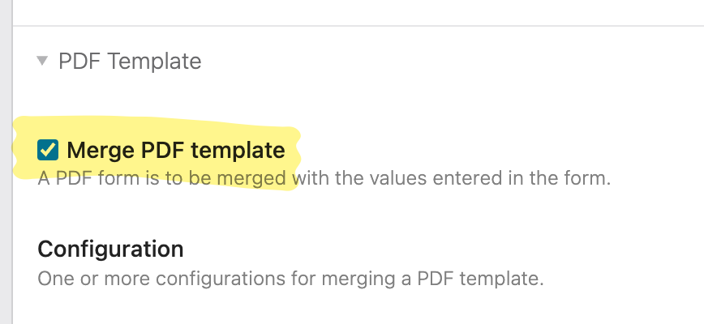
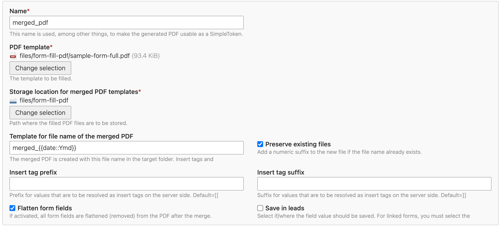

# Contao Form Fill PDF Bundle

[](https://packagist.org/packages/cgoit/contao-form-fill-pdf-bundle)

[](https://packagist.org/packages/cgoit/contao-form-fill-pdf-bundle)
[](https://packagist.org/packages/cgoit/contao-form-fill-pdf-bundle)

With this bundle you are able to fill PDF forms with the submitted data of any contao form.

## Setup ##

Setup is currently only possible by composer or the contao manager. Just require or search for ```cgoit/contao-form-fill-pdf-bundle``` and install it.

## Requirements ##

***IMPORTANT***: The bundle requires [`pdftk`](https://www.pdflabs.com/tools/pdftk-the-pdf-toolkit/) binary to be present on the server. If the `pdftk` binary is not present or usable on your server you can't fill your PDF templates with this bundle.

It might be possible that you can provide the appropriate binary for your architecture and set your `LD_LIBRARY_PATH` accordingly but this is not tested and I can't give you any guarantee that this will work.

## How does this bundle work? ##

To be honest: this bundle doesn't do much on it's own. Most of the hard work of merging your data with the PDF template is done by the outstanding library [`php-pdftk`](https://github.com/mikehaertl/php-pdftk). This bundle only prepares all the data which is then provided to this library together with the selected PDF template. Thus all the limitations (e.g. UTF-8 support, etc.) of the `php-pdftk` library are also limitations of this bundle.

## How to use? ##

### Prepare your PDF template ###

First of all you need a PDF template in which you will merge your form data. You can create your template with every tool which is able to create PDF forms.
Inside of this template give your form fields names with SimpleTokens. Doing so, the data will be merged into this fields afterwards.

You can use the following SimpleTokens: 

- `##form_*##`: `*` is the name of your form field in the contao form
- `##formconfig_*##`: `*` is a property of your contao form, e.g. `id`
- `##admin_email##`: the email of the administrator
- `##filenames##`: a list of submitted filenames

#### Special cases ####

Currently I know three special cases where we have to talk about.

1. Radio buttons: If you have a radio button menu in your HTML form you'll have to take care that the `on`-value in your PDF form matches the corresponding values in your HTML radio button. E.g. if your radio button is named `test` with the values `1`, `A` and `all` you'll have to add three radio buttons to your PDF form as well. All of them are named `##form_test##`. The `on` values for the radiobuttons are `1`, `A` and `all`.
2. Checkboxes: When you have checkboxes in your form the user normally is able to check multiple of them in the frontend. Every checkbox will have a different value. In your PDF template you'll have to append this value prefixed with an underscore to the fieldname. E.g. if your checkbox in your HTML form is named `test` with the values `1`, `A` and `all` your fieldnames in your PDF template will be `##form_test_1##`, `##form_test_A##` and `##form_test_all##`. The `on` value of the checkboxes in the PDF form is always `1` for those fields.
3. File upload: Currently it's not possible to include the file itself in the merged PDF. If you add a file to your PDF only the path (as string) will be merged.

### Prepare your form ###

In the configuration of your form you can enable the merging of data into your PDF templates via checking `Merge PDF template`



You then have to configure at least one PDF template which should be merged.



| Option | Default value             | Description                                                                                                                                                                                                                                                                                                                                        |
|-------|---------------------------|----------------------------------------------------------------------------------------------------------------------------------------------------------------------------------------------------------------------------------------------------------------------------------------------------------------------------------------------------|
| Name | -                         | The name for your configuration. This name will be used to extend the SimpleTokens. If you have installed the [`terminal42/notification_center`](https://github.com/terminal42/contao-notification_center) you are able to attach the merged PDF to a notification email. To do so you'll have to attach the file via the SimpleToken `##form_<name>` where `<name>` is equal to the value of this option. |
| PDF template | -                         | The template which has the form fields which should be filled.                                                                                                                                                                                                                                                                                     |
| Storage location for merged PDF templates | -                         | The path where the merged PDFs should be stored.                                                                                                                                                                                                                                                                                                   |
| Template for file name of the merged PDF | \<Form id\>_{{date::Ymd}} | The filename template. You can use SimpleTokens (`##form_*##`, `##formconfig_*`, ...) and  InsertTags (`{{date}}`, `{{env::host}}`, ...) as variables in the filename template.<br/>**You shouldn't add the extension `.pdf` to the name template because this filename extension is added automatically in the backend!**                         |
| Insert tag prefix | [[                        | The prefix to use for InsertTags. You can use this InsertTag e.g. in hidden fields of your form (see explanation down below for further information).                                                                                                                                                                                              |
| Insert tag suffix | ]]                        | The suffix to use for InsertTags. You can use this InsertTag e.g. in hidden fields of your form (see explanation down below for further information).                                                                                                                                                                                              |
| Flatten form fields | false                     | If checked all the form fields are removed from the result PDF after merging your data.                                                                                                                                                                                                                                                            |
| Save in leads | false                     | If you have installed the [`terminal42/contao-leads`](https://github.com/terminal42/contao-leads) bundle you can store the merged PDF also in your leads.                                                                                                                                                                                                                                    |

## Compatibility with other extensions ##

As described above this extension works perfectly well with `terminal42/notification_center` and `terminal42/contao-leads`. There is also a solution if you want to combine this extension with `terminal42/contao-mp_forms`.

### Use with `terminal42/contao-mp_forms` ###

If you have the use case to collect some data in a multi step form created with `terminal42/contao-mp_forms` **and** want to show the merged PDF e.g. on the summary step **before** you finally submit the form you can add a new FormField `Generate PDF` in your form configuration. If this FormField is present it will merge the data which is collected until this step into the selected PDFs and stores the result in the `$_SESSION['FILES']` array. Doing so you can refer to the merged PDF via the well-known Simple Tokens described above. 

## How to test ##

To make things easy a sample pdf template and a sample form is included in this bundle.

During installation/migration the sample PDF form as well as a sql script is copied to `files/form-fill-pdf`. You can import the `contao-form-fill-pdf-demo-form.sql` into your database. This will create a form in contao with every possible form field type (textfields, check box menus, password fields, ...). The also copied `sample-form.pdf` can be used to merge the data from this contao form.

